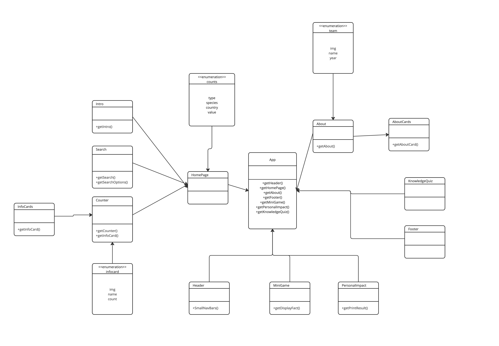

**Report**
Our codebase is provided by Michelle and her INFO340 team. This is a React app. The website is about endangered animals. The aim of this project is to spread awareness of animals that are endangered. Pulling data from various sources we have prepared graphs that will give people answers to what is going with these animals.

**P1 checkpoint #2: structure diagrams**

UML Class Diagram

