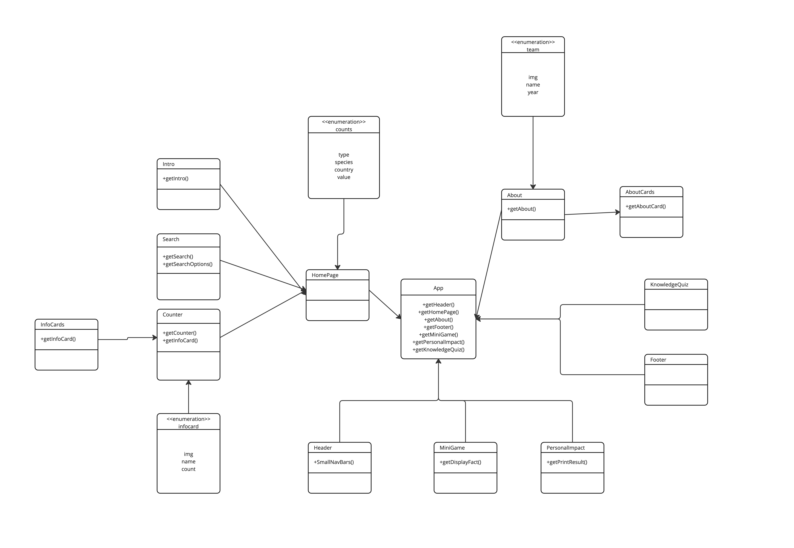

# Code Structure Analysis

The purpose of our React website is to provide statistical information that helps audiences understand extinct animals and raise awareness to protect them. There are three functions of the website: an interactive dashboard, mini flashcard games, and personal impact quizzes. In addition to three functions, there is an About page that introduces our teammates and the purpose of the project. All of our components were built based on these three functionality of the website.

- **Interactive Dashboard:** This component displays statistical information about extinct animals based on the user’s selection and filter.

- **Mini Flashcard Game:** This component would randomly present an animal card with the number of animal species left. It is built using react components handleClick, card, and props.

- **Personal Impact Quiz:** This component presents a list of multiple choice questions for users to select. It tests users' general habits and how these habits can impact the planet. The component imports two libraries: React and Firebase and functions like “getDatabase”, “ref”, “set”, “onValue”, and “push”, to get access to the database.

- **About page:** This component would introduce the purpose of the project and our mission and a short description of each member. It consists AboutCards.js, with team member’s names and images, and a react library.

In addition to these components, there are other components that work as a part of the website, such as Footer, Header, and Introduction. Additionally, JSON files are used to pass data into the database and modules.

**Relationships/dependencies**

App.js is the root component that serves as the foundation for the entire React application, and all other components are connected.

The HomePage component imports the following components to create a comprehensive landing page:

- Counter component, which further imports:
  -  InfoCards component for a collection of statistics
- Search component for filtering and finding specific endangered species
- Intro component introduces the goal of the website and guides users to take actions
- Counts display a visual representation of the endangered species data

Other components are directly connected to App.js, each serving a specific purpose within the application:
- Header component for displaying the application's title and navigation menu
- MiniGame component for engaging users with interactive games related to endangered species
- PersonalImpact component to educate users on how their actions can affect endangered species
- KnowledgeQuiz component for testing users' knowledge of endangered species and conservation efforts
- Footer component to display additional information

The About component is also connected to App.js and imports the following child components to present more information about the project and the team behind it:

- AboutCards component for displaying details about the project's mission and goals
- Team component to showcase the team members and their roles in the project

UML Class Diagram

UML Sequence Diagram

**Code's process flows**

The process flows of our React-based website involve a series of interconnected components working together to provide users with an educational and interactive user experience. The main process flows include rendering the HomePage, interacting with the Dashboard, playing the Mini Flashcard Game, taking the Personal Impact Quiz, and visiting the About Page.

**Rendering the HomePage:**
a. App.js serves as the root component and renders the HomePage component.

b. HomePage calles and displays the Counter, Search, Intro, and Counts components.

c. The Counter component further imports and displays InfoCard and InfoCards components.

d. The Header and Footer components are rendered on every page.

**Interacting with the Dashboard:**

a. Users can filter endangered species data using the Search component.

b. The Search component updates the state of the selected country, species, and data type.

c. Once the filter is applied, the Counter component updates the displayed InfoCard and InfoCards components based on user selections.

**Playing the Mini Flashcard Game:**

a. Users access the MiniGame component from the navigation menu.

b. The game presents animal cards with the number of remaining species.

c. Users interact with the game by clicking on cards, which triggers the handleClick event.

**Taking the Personal Impact Quiz:**

a. Users access the PersonalImpact component from the navigation menu.

b. The quiz presents multiple-choice questions related to the user's habits and their potential impact on the environment.

c. Users submit their answers, which are stored in the Firebase database using functions like "getDatabase", "ref", "set", "onValue", and "push".

**Visiting the About Page:**

a. Users access the About component from the navigation menu.

b. The About component imports and displays the AboutCards and Team components.

c. AboutCards provides information about the project's mission and goals, while the Team component showcases individual team members and their roles.

Throughout this process flows, the website maintains a consistent look and feels by rendering the Header and Footer components on every page. The seamless integration of these components ensures an intuitive and engaging user experience while navigating through different sections of the website.

# Architecture Assessment

Architectural com appears to have a few architectural problems in the provided code, including code smells, documentation concerns, and design quality deficiencies. These issues are as follows:

Code Smells:

- Useless state initialization: The selectCountry, selectSpecies, and selectDataType variables are declared using useState, but their initial values are never used. This is a code smell that suggests the possibility of refactoring or improvement. These unused initial values can clutter the code and make it harder to understand, modify, and maintain.

- Duplicate code: The Search and Results components contain similar codes for handling the search functionality. This is a code smell that suggests the possibility of refactoring or improvement. Duplicated code can lead to maintenance issues, as changes need to be made in multiple places, making the code harder to maintain.

- Inconsistent variable naming: The variable names used in the code need to be more consistent, making it harder to read and understand. For example, some variables use the CamelCase naming convention, while others use the camelCase naming convention. This is a code smell that suggests the possibility of refactoring or improvement. Consistent variable naming can make the code more readable and easier to understand.

Documentation/Readability Concerns:

- Lack of documentation: The code needs documentation, which makes it easier for other developers to understand and maintain the code. Comments and inline documentation can be added to explain what each function does or what the component is used for.

- Poorly written comments: Some of the comments in the code could be clearer or more accurate, making it easier to understand the code. For example, the comment "Set species variable on change" in the Search component does not provide enough context to understand what is happening in the code.

Standards Violations:

- Accessibility standards: The code does not conform to accessibility standards for web development. For example, the input fields do not have proper labels or instructions for screen readers. This is a standard violation that needs to be addressed. Accessibility is an important aspect of web development and should be considered when developing web applications.
- Variable naming standards: The code violates JavaScript variable naming conventions using CamelCase instead of camelCase. This violation of standard naming conventions may make it harder for other developers to read and understand the code.

Design Quality Deficiencies:
- Poor modifiability: The Search component is tightly coupled to the props passed down from the App component. This makes it easier to modify the Search component by modifying the App component. This is a design quality deficiency that suggests the possibility of refactoring or improvement. A more modular design could make the code more maintainable and easier to modify.
- Lack of error handling: The code needs proper error handling, which can cause the application to crash or behave unpredictably. Error handling is an important aspect of software development, and the lack of proper error handling is a design quality deficiency that needs to be addressed.

Other than the criterias, here is a list of the architectural deficiencies I have identified in the codebase, along with a brief explanation and the approximate location of each problem:
- Poor variable naming: Variable names such as selectCountry, selectSpecies, and selectDataType need to accurately reflect their purpose, making the code less readable.
- Overuse of useState: Multiple useState calls can lead to performance issues and could be refactored to use a single state object.
- Mixing of logic and presentation: The handleButton function contains logic and presentation, violating the separation of concerns principle.
- Lack of error handling: There is no error handling for events such as when the server is down, or the user inputs invalid data.
- Hardcoded values: The text "Australia" and "Mammals" are hardcoded, making updating or maintaining the code difficult.

To address these problems, we can consider several possible solutions. For the code smells and documentation concerns, we can add inline comments and refactor the code to remove any unused state initialization. We can also ensure that our variable names are consistent with standard naming conventions. On top of that we will also consider restructuring the component to be more modular and easier to maintain to address the modifiability and testability problems. We can also expose more functions as props or consider re-writing the component using a different design pattern that separates concerns more effectively. Finally, we can consider writing more automated tests to improve test coverage and ensure the component functions as expected.

Overall, the Search component has several architectural problems that should be addressed to improve the maintainability and testability of the code. By refactoring and restructuring the component, we can make it easier to maintain, test, and ensure that it conforms to standard design practices and naming conventions.the component using a different design pattern that separates concerns more effectively.

# Automated Tests
This Jest test suite is created for a React Search component. The suite comprises tests for three major functions: hitting the 'Go!' button, picking an item from the drop-down menu, and checking the 'Data Type' checkbox.
The first test series determines if the 'Go!' button is visible on the screen and whether it invokes the 'applyFilterCallback' method with the appropriate parameters. The second set of tests verifies that the drop-down menu is shown correctly and that it displays no choices when the passed array is empty. The last set of tests determines if the 'Data Type' checkbox is unchecked by default and whether clicking it affects the 'applyFilterCallback' function.
All tests use the '@testing-library/react' library to render the Search component. Interact with the Search component using user events like 'click' and 'change' to see if the anticipated results have been returned. Jest has assertions for determining if the predicted output of functions corresponds to the actual output.
These tests are designed to ensure that the Search component renders the necessary UI components, that user interactions function as anticipated, and that state changes caused by these interactions are handled effectively. The tests assist developers in detecting and correcting errors before release, resulting in higher-quality software with fewer defects.

**Test Suite Instructions**
The tests for this project can be found in the tests directory, specifically under the Search.test.js file. To run the test suite, follow these instructions:
Ensure that you have Node.js and npm installed on your machine. If not, you can download and install them from Node.js official website.
In the terminal, navigate to the project root directory and run npm install to install all the necessary dependencies.
Run the command npm run test to execute the test suite. The results will be displayed in the terminal.

**Testing Rationale**
We chose to test the following aspects of the code, mainly focusing on the user interactions and rendering behavior of the Search and SearchOptions components:
- Button rendering and click behavior: We tested if the "Go!" button is rendered correctly and if it calls the applyFilterCallback function with the correct arguments when clicked. This ensures that the search functionality works as intended.
- SearchOptions rendering: We tested if the SearchOptions component renders all options passed in as props, as well as if it renders no options when an empty array is passed as props. This ensures that the search options are displayed correctly based on the given data.
- Checkbox behavior: We tested if the checkbox is not checked by default and if it updates correctly when clicked. This ensures that the user can toggle the checkbox to include or exclude certain data types in their search.
Country and Species select inputs: We tested if the selected country and species update correctly when the select input values change. This ensures that the search parameters can be changed by the user as needed.

**Test Cases and Justification**
Here is a list of the test cases along with a brief justification for each:
- HandleButton renders a button with text 'Go!': Ensures the button is rendered as intended.
- HandleButton calls applyFilterCallback with correcwt arguments: Validates that the search functionality is triggered with the right parameters.
- HandleButton calls applyFilterCallback with the correct state: Confirms the state updates correctly for the search parameters.
- SearchOptions renders all options passed in as props: Checks if the search options are displayed correctly.
- SearchOptions renders no options when empty array is passed as props: Validates the component behavior when no options are provided.
- Select data type checkbox updates the checkbox when clicked: Verifies the correct behavior of the checkbox for user interaction.
- Select data type checkbox is not checked by default: Confirms the initial state of the checkbox.
- Select country input updates the selected country when select input value changes: Ensures the correct country is selected during user interaction.
- SelectCountries updates selectCountry state correctly: Validates the state updates for the country selection.
- SelectCountry updates the state of the country select correctly: Verifies the state updates based on user input.
- Select species input updates the selected species when select input value changes: Ensures the correct species is selected during user interaction.
- SelectSpecies updates the state of the species select correctly: Verifies the state updates based on user input.

# Refactoring the Code
